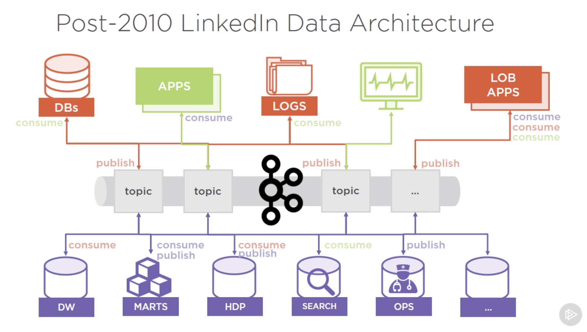
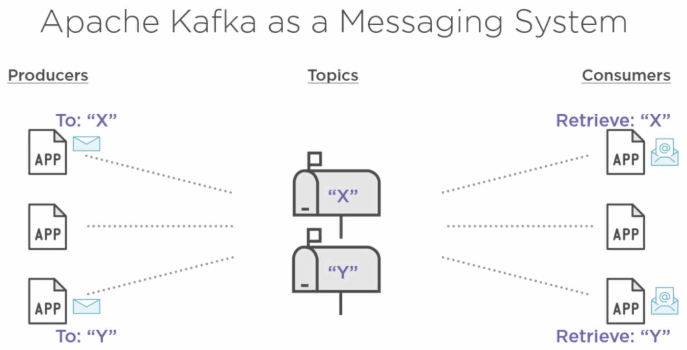
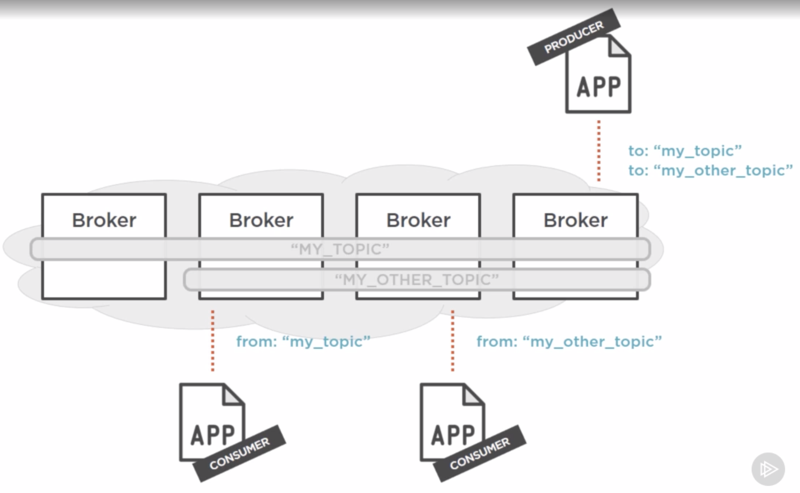

## Apache Kafka Notes
- A high-throughput distributed messaging system

### Chapter 1: History
#### Database Replication & Log Shipping
- RDBMS to RDBMS only
- Database specific
- tight coupling (e.g. schema)
- Performance challenges for log shipping
- complication due to subscription setup

#### ETL (Extract, Transform, Load)
- Typically costly, proprietary
- scalability challenge
- custom training

#### Messaging
- limited scalability
- require rapid consumption
- not fault-tolerant
- smaller messages to process
- traditionally, if consumer slow/dead or publisher too fast without throttle, broker local storage corrupted due to message buildup
- message processing bug -> message lost
- developers have to implement middleware to maintain consistency
  - increasing complexity
  - potentially expensive

#### Ideal Data Transfer System:
1. Clean data movement
2. Reliable & Durable: able to survive component crash
3. Less coupling within components (Producers & Consumers)
4. High throughput (horizontally scalable)
5. Flexible publish-subscribe semantics: Kafka as central broker

### Chapter 2: Architecture

##### Broker Role
- messages in topics kept in broker
- broker as a daemon software process running on a machine
- broker with access to file system
- number of brokers can be increased to enhance throughput
##### Cluster
- cluster of brokers
- brokers can run on different or the same machines
- ZooKeeper to help manage broker grouping semantics: a centralized service for maintaining metadata about a cluster of distributed nodes, used in Redis, Hadoop, HBase etc.
- essentially a distributed system to achieve a common goal: process messages
- a leader to assign a worker and some peers (number of peers configurable: replication factor) to take
- the work is to process message, assign to relevant topics and persist the messages
- Other forms of communications among nodes through protocols like Gossip: leader election, worker node naming and membership, configuration management, health status -> ZooKeeper's job

##### Kafka Topics
- central Kafka abstraction
- named feed or category of messages: for producers to produce into and consumers to consume from
- Logical entity

- topic could span multiple brokers
- when producers send a message to a Kafka topic:
  1. appended to a time-ordered sequential stream
  2. immutable facts as events
  3. consumer's job process all events, producer not changing any
  4. known as event sourcing: an architectural style or approach to maintaining an application's state by capturing all changes as a sequence of time-ordered, immutable events
- when consumers consume from topics
  1. can recover by going back to a previous read commit (message offset)
  2. message offset: last read message position maintained by consumer
  3. many consumers can process together

##### Message
- timestamp
- id
- data (binary payload)

##### Message Retention Policy
- default retained for 7 days
- defined per topic
- based on storage available as well
